# Microsoft Foundry Agents with On-Behalf-Of (OBO) Authentication

This repository provides sample code and comprehensive instructions for setting up Microsoft Foundry Agents that use the On-Behalf-Of (OBO) authentication flow to securely access third-party services through MCP (Model Context Protocol) servers.

---

## Table of Contents

- [Overview](#overview)
- [Architecture](#architecture)
- [Prerequisites](#prerequisites)
- [Repository Structure](#repository-structure)
- [Setup Instructions](#setup-instructions)
  - [1. User Setup](#1-user-setup)
  - [2. Atlassian MCP Server Setup](#2-atlassian-mcp-server-setup)
  - [3. Microsoft Fabric Data Agent Setup](#3-microsoft-fabric-data-agent-setup)
  - [4. Deploy Azure AI Foundry Resources](#4-deploy-azure-ai-foundry-resources)
  - [5. Configure MCP Tools in Foundry](#5-configure-mcp-tools-in-foundry)
  - [6. Create the Foundry Agent](#6-create-the-foundry-agent)
  - [7. Run the Sample Application](#7-run-the-sample-application)
- [Testing the OBO Flow](#testing-the-obo-flow)
- [Troubleshooting](#troubleshooting)
- [Additional Resources](#additional-resources)
- [License](#license)

---

## Overview

Data access through Agents is a key capability of Microsoft Foundry. Agents can access data from various sources using MCP tools. In scenarios where the data source is a third-party service, it is critical to ensure that data access is secure and follows the principle of least privilege.

The **On-Behalf-Of (OBO) authentication flow** allows Foundry Agents to access third-party services on behalf of the logged-in user, ensuring that:

- Data access is controlled based on user identity
- Row-level security policies are enforced
- All access is auditable

### What This Repository Demonstrates

1. **Atlassian Integration**: A custom MCP server that wraps Atlassian Jira and Confluence REST APIs with OBO token validation
2. **Microsoft Fabric Integration**: Using the Fabric Data Agent MCP tool with OBO flow to enforce row-level security on Lakehouse data
3. **Tool Level Authorization**: Use MCP Authorization Middleware for custom tools that checks for user license and exposes only the allowed tools to the agent. For e.g:
   * Premium user gets access to Atlassian Jira, Confluence and Fabric Data Agent tools.
   * Freemium user gets access to only Atlassian Jira and Fabric Data Agent tool.


---

## Architecture

```
┌─────────────────┐     ┌──────────────────────┐     ┌─────────────────────────┐
│   React SPA     │────▶│  FastAPI Backend     │────▶│  Azure AI Foundry       │
│  (MSAL Auth)    │     │  (Token Validation)  │     │  Agent Service          │
└─────────────────┘     └──────────────────────┘     └───────────┬─────────────┘
                                                                 │
                              ┌──────────────────────────────────┼──────────────────────────────────┐
                              │                                  │                                  │
                              ▼                                  ▼                                  │
                 ┌─────────────────────────┐      ┌─────────────────────────┐                       │
                 │  Custom Atlassian MCP   │      │  Fabric Data Agent MCP  │                       │
                 │  Server (Azure ACA)     │      │  (Microsoft Managed)    │                       │
                 └───────────┬─────────────┘      └───────────┬─────────────┘                       │
                             │                                │                                     │
                             ▼                                ▼                                     │
                 ┌─────────────────────────┐      ┌─────────────────────────┐                       │
                 │  Atlassian Cloud        │      │  Microsoft Fabric       │                       │
                 │  (Jira & Confluence)    │      │  Lakehouse (with RLS)   │                       │
                 └─────────────────────────┘      └─────────────────────────┘                       │
```

This architecture uses a single agent with multiple MCP tools to access data from both Atlassian and Microsoft Fabric Lakehouse.
Here is example prompt used by the agent to determine which tool to use:

```
You are a tool use assistant.
You can answer questions based on the tools attached to you. 
Only use the tools to get information and answer questions.
If the tool returns URLs, format them as clickable links in markdown.
Always state the tool you are using.
If you cannot find the answer using the tools, respond with "I don't know". 
```


### Key Components

| Component | Description |
|-----------|-------------|
| **React SPA** | Single-page application using MSAL for Microsoft Entra authentication |
| **FastAPI Backend** | Validates tokens and proxies requests to Foundry Agent Service |
| **Azure AI Foundry** | Hosts the agent and manages MCP tool connections |
| **Custom MCP Server** | Validates OBO tokens and proxies requests to Atlassian APIs |
| **Fabric Data Agent** | Microsoft-managed MCP tool for Fabric data access with RLS |

---

## Prerequisites

### Required Accounts and Subscriptions

| Requirement | Description |
|-------------|-------------|
| **Azure Subscription** | With permissions to create Azure AI Foundry resources, Azure Container Apps, and Azure Container Registry |
| **Microsoft Entra ID** | Tenant with ability to create app registrations and users |
| **Atlassian Cloud Account** | Free or paid account with Jira and Confluence access |
| **Microsoft Fabric** | Workspace with capacity to create Lakehouses and Data Agents |

### Required Permissions

| Resource | Required Role |
|----------|---------------|
| Azure AI Foundry | Azure AI Account Owner, Role Based Access Administrator |
| Azure Container Registry | Contributor or ACR Push/Pull |
| Microsoft Fabric | Workspace Admin (for RLS configuration) |
| Microsoft Entra ID | Application Administrator (for app registrations) |

### Development Tools

| Tool | Version | Purpose |
|------|---------|---------|
| **Python** | 3.10+ | Backend API and agent creation scripts |
| **Node.js** | 18+ | React frontend application |
| **Docker** | Latest | Building and deploying the MCP server |
| **Azure CLI** | Latest | Azure resource deployment |

### Python Dependencies

**MCP Server** (`custom_jira_confluence_mcp_server/requirements.txt`):
```
fastapi>=0.110
uvicorn[standard]>=0.29
httpx[socks,http2]
fastmcp
python-dotenv
pydantic
```

**Backend API** (`foundry_agent_backend_api/requirements.txt`):
```
fastapi
uvicorn
pyjwt
cryptography
azure-ai-projects>=2.0.0b1
python-dotenv
```

**Agent Scripts** (`foundry_agents/requirements.txt`):
```
azure-ai-projects
python-dotenv
```

### Node.js Dependencies

The React SPA uses:
- `@azure/msal-browser` ^4.27.0
- `@azure/msal-react` ^3.0.23
- `react` ^19.2.3

---

## Repository Structure

```
├── bicep-basic-agent-setup/          # Basic Foundry deployment template
├── bicep-standard-agent-setup/       # Standard Foundry deployment with dependencies
│   ├── main.bicep
│   ├── azuredeploy.json
│   └── modules-standard/             # Bicep modules for role assignments
├── custom_jira_confluence_mcp_server/
│   ├── atlassian_mcp_server_jira_confl.py  # MCP server implementation
│   ├── Dockerfile
│   ├── docker_build.ps1              # Windows deployment script
│   ├── docker_build.sh               # Linux/macOS deployment script
│   └── requirements.txt
├── foundry_agent_backend_api/
│   ├── foundry_agent_server.py       # FastAPI backend
│   └── requirements.txt
├── foundry_agents/
│   ├── create_multitool_prompt_agent.py  # Agent creation script
│   └── requirements.txt
├── spa_foundry_agent_webapp/
│   ├── src/
│   │   ├── App.js                    # Main React component
│   │   └── authConfig.js             # MSAL configuration
│   └── package.json
├── sample_data/
│   └── invoices/                     # Sample invoice data for Fabric
└── images/                           # Documentation screenshots
```

---

## Setup Instructions

### 1. User Setup

Create test users to demonstrate the OBO flow and row-level security:

1. **Microsoft Entra Users**: Create two users (UserA and UserB) in your Microsoft Entra tenant

2. **Fabric Workspace Access**: Add UserA and UserB to the Fabric Workspace with Viewer permissions. Ensure they can log into the Fabric portal at least once.

3. **Atlassian Users**: Create corresponding accounts in [Atlassian Cloud](https://www.atlassian.com/software/jira/free)
   - Create sample Jira projects and issues
   - Create sample Confluence spaces and pages
   - Note down the user unique identifiers (user_sub) to update user_access_list.json in the custom_jira_confluence_mcp_server directory.
   - Navigate to [Atlassian Admin](https://admin.atlassian.com/) → Users → Select User → URL will have the user ID at the end: e.g.`557058:d665a061-d4e6-4561-a263-202befc4db75`
   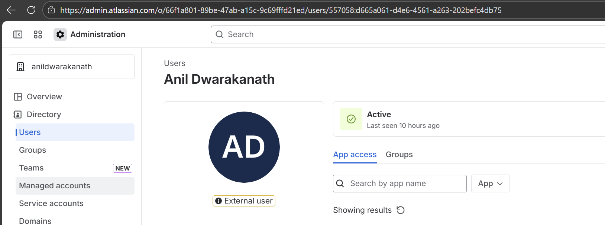

4. **Identity Flow**: In the OBO flow:
   - Atlassian user identity is used for Jira/Confluence data access
   - Microsoft identity is used for Foundry Agent Service and Fabric Data Agent authentication

---

### 2. Atlassian MCP Server Setup

#### 2.1 Create Atlassian OAuth App

1. Navigate to the [Atlassian Developer Console](https://developer.atlassian.com/console/myapps/)

2. Create a new OAuth 2.0 app:

   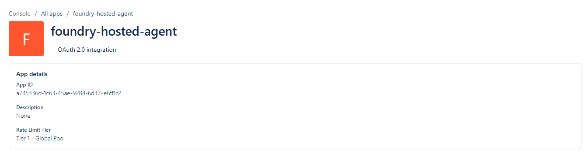

3. Configure API scopes for Confluence and Jira:

   **Jira Scopes:**
   
   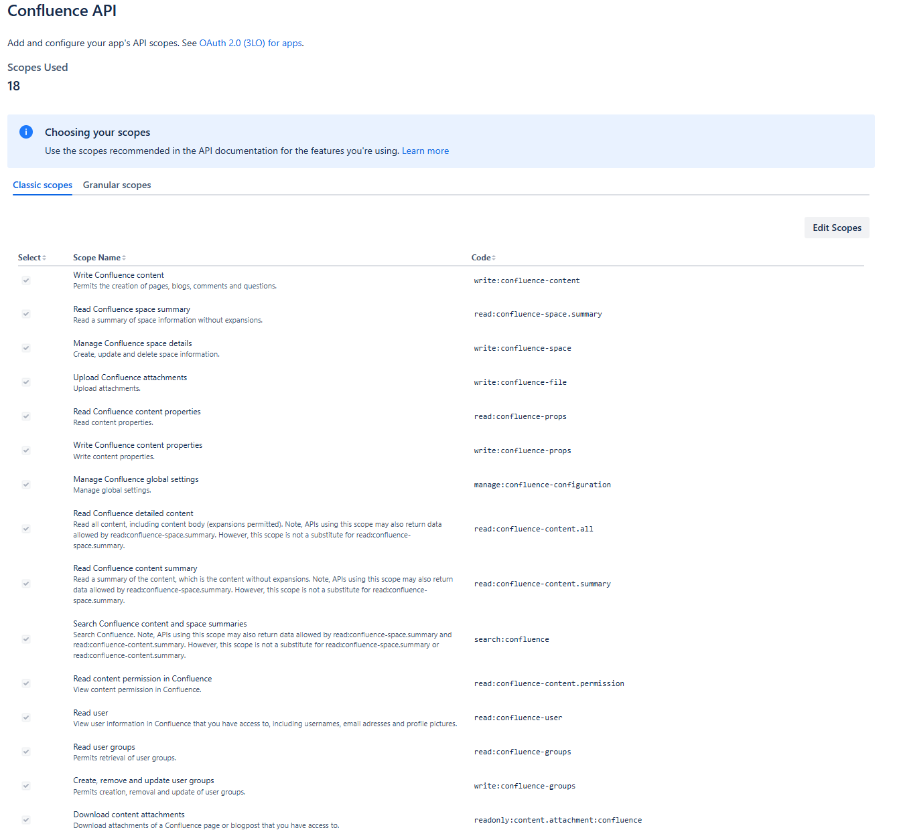

   **Confluence Scopes:**
   
   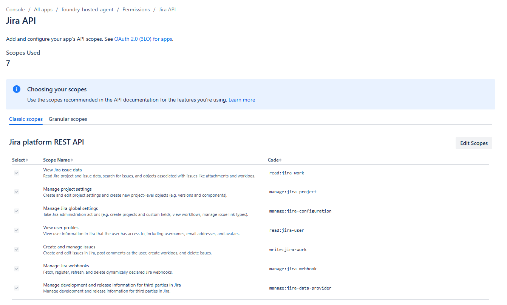

4. Configure Authorization settings:

   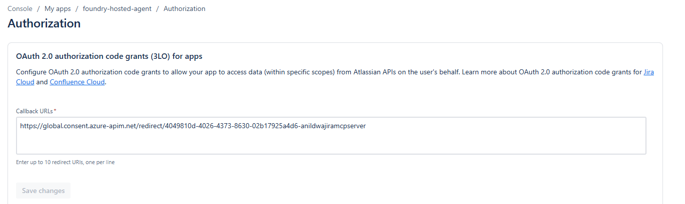

5. Copy the **Client ID** for later use:

   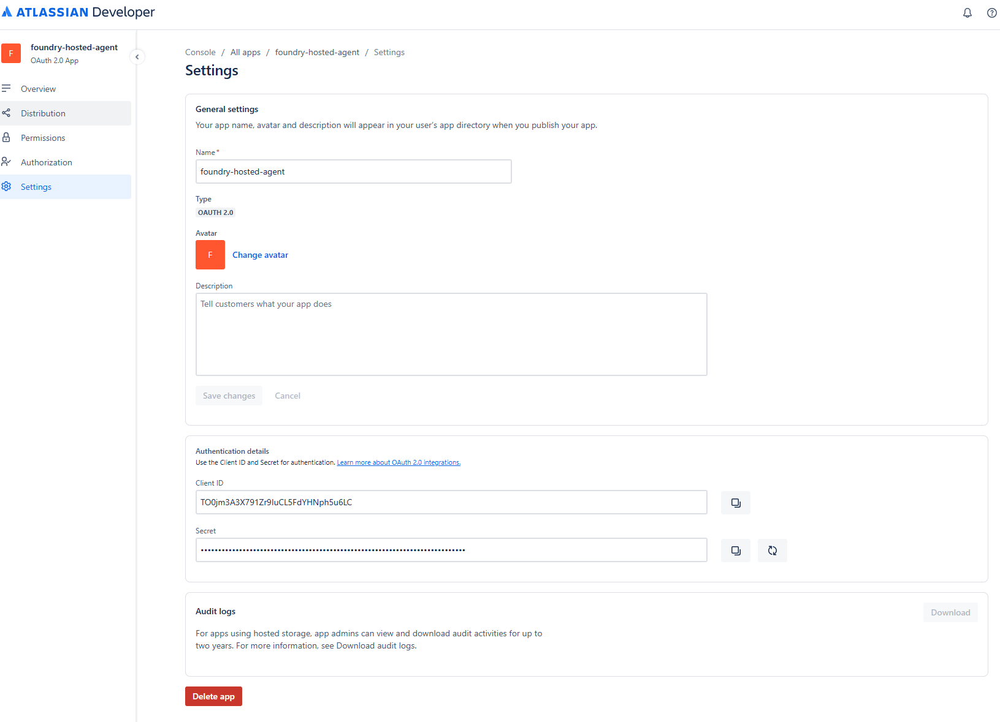

#### 2.2 Build and Deploy the MCP Server

The custom MCP server wraps Atlassian REST APIs using [FastMCP](https://github.com/jlowin/fastmcp). It validates incoming OBO tokens before forwarding requests to Atlassian.

**Deployment Steps:**

1. Navigate to the MCP server directory:
   ```bash
   cd custom_jira_confluence_mcp_server
   ```

2. Create the environment file:
   ```bash
   cp .env.sample .env
   ```

3. Configure the `.env` file:
   ```env
   ATLASSIAN_CLIENT_ID=<your_atlassian_client_id>
   ```

4. Deploy using Docker to Azure Container Apps:

   **Windows (PowerShell):**
   ```powershell
   .\docker_build.ps1 -AcrName <acr_name> -ImageName <image_name> -ImageVersion <version>
   ```

   **Linux/macOS:**
   ```bash
   chmod +x docker_build.sh
   ./docker_build.sh -a <acr_name> -i <image_name> -v <version>
   ```

   **Options:**

   | Parameter | Description |
   |-----------|-------------|
   | `-a` / `-AcrName` | Azure Container Registry name |
   | `-i` / `-ImageName` | Docker image name |
   | `-v` / `-ImageVersion` | Image version tag |
   | `-b` | (Optional) Use ACR build instead of local Docker |

5. Verify deployment:

   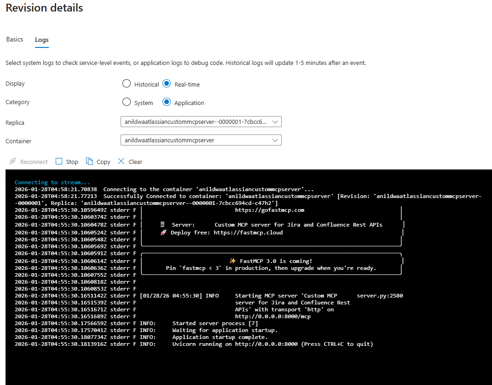

   Accessing the MCP Server endpoint without a valid token should return `401 Unauthorized`:

   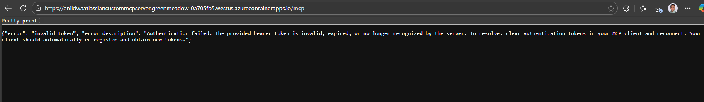

---

### 3. Microsoft Fabric Data Agent Setup

#### 3.1 Create the Lakehouse

1. Create a Lakehouse in Microsoft Fabric following [Getting Started with Lakehouses](https://learn.microsoft.com/en-us/fabric/data-engineering/lakehouse-and-delta-tables)

2. Enable **User Identity mode** on the SQL Analytics endpoint:

   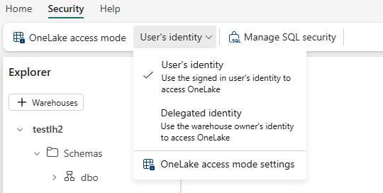

#### 3.2 Load Sample Data

1. Upload the sample invoice data from `sample_data/invoices/` to your Lakehouse:

   

2. Load data into a Delta table:

   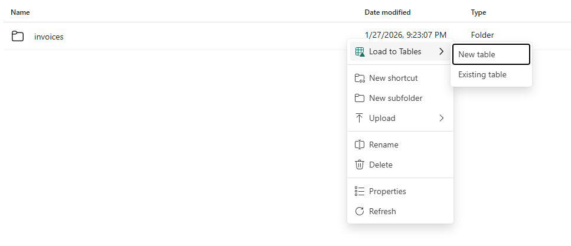

3. Verify the table schema:

   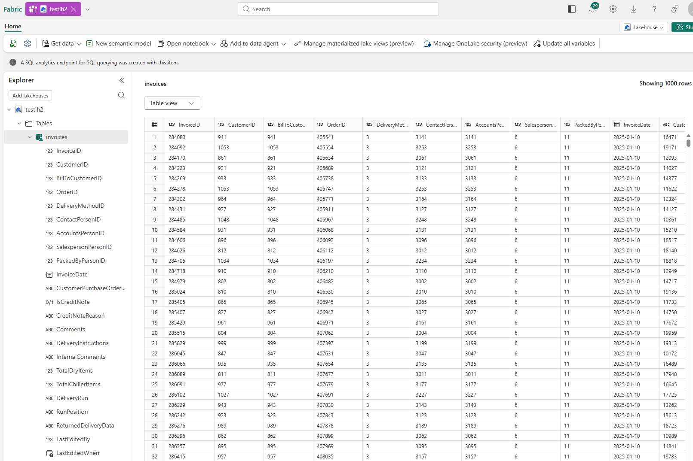

#### 3.3 Configure Row-Level Security

1. Follow the [OneLake Security documentation](https://learn.microsoft.com/en-us/fabric/onelake/security/get-started-onelake-security) to set up RLS

2. Create two Data Access Roles:

   | Role | Filter Condition | Assigned User |
   |------|------------------|---------------|
   | RoleA | CustomerID = 834 | UserA |
   | RoleB | CustomerID = 821 | UserB |

   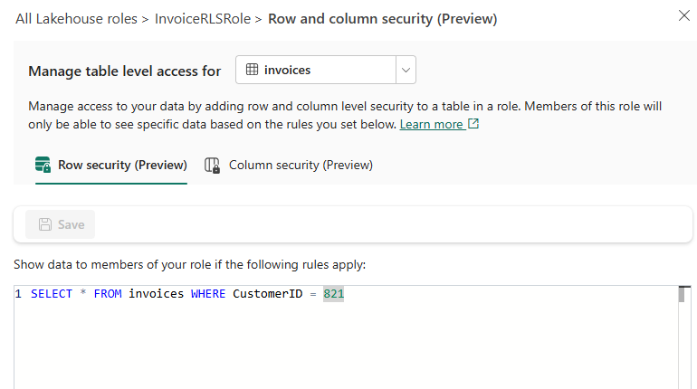
   
   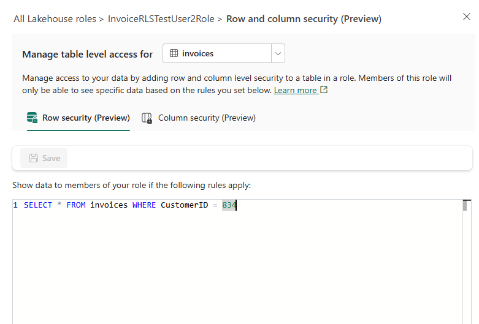

#### 3.4 Create and Publish the Data Agent

1. Add a Data Agent to the invoice table:

   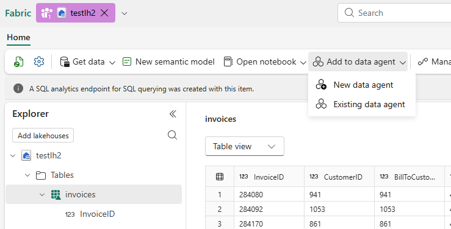

2. Configure the agent instructions:
   ```
   You are an Invoice Data agent. You can answer questions about Invoice and nothing else. 
   Use the provided invoices table data to answer. If you cannot answer, state that you can 
   answer questions only about invoices.
   ```

   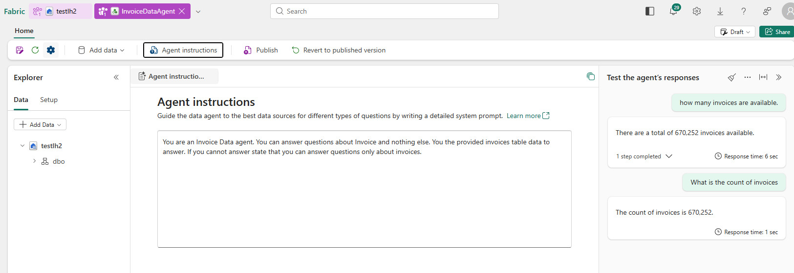

3. **Publish the Data Agent** and save the connection details:

   From the URL:
   ```
   https://api.fabric.microsoft.com/v1/workspaces/{workspace_id}/dataagents/{artifact_id}/aiassistant/openai
   ```

   | Parameter | Example Value |
   |-----------|---------------|
   | Workspace ID | `b1a1dad3-61f0-4438-be14-1651717fcaf7` |
   | Artifact ID | `19d45d8e-068c-4063-bc9f-d0e89a91050d` |

   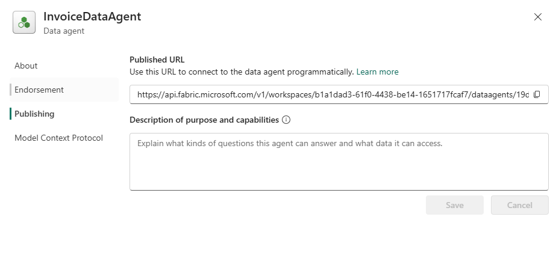

---

### 4. Deploy Azure AI Foundry Resources

Use the Bicep template to deploy Foundry resources with a standard agent project.

1. Create a resource group:
   ```bash
   az group create --name <resource-group-name> --location westus
   ```

2. Deploy the template:
   ```bash
   cd bicep-standard-agent-setup
   az deployment group create --resource-group <resource-group-name> --template-file main.bicep
   ```

   > **Required Permissions**: Azure AI Account Owner, Role Based Access Administrator

   For detailed instructions, see the [bicep-standard-agent-setup README](bicep-standard-agent-setup/README.md).

3. **Assign users to the Foundry project**:
   - Add UserA and UserB to the project with **Azure AI User** role
   - Ensure these users match the Microsoft Entra users created earlier

---

### 5. Configure MCP Tools in Foundry

#### 5.1 Create the Atlassian MCP Tool

1. In Foundry, navigate to **Build** → **Tools** → **Custom** → **MCP Tool**

2. Configure OAuth Identity Passthrough:

   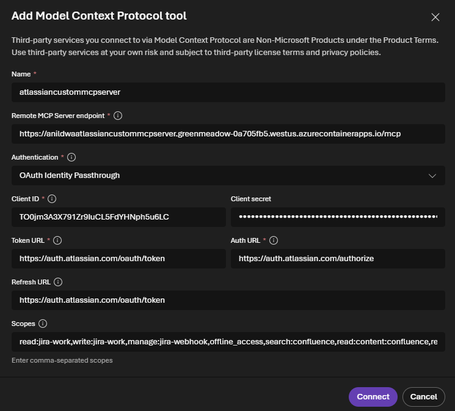

   | Setting | Value |
   |---------|-------|
   | MCP Server URL | `https://<your-aca-name>.<region>.azurecontainerapps.io/mcp` |
   | Client ID | Your Atlassian app Client ID |
   | Authorization URL | `https://auth.atlassian.com/authorize` |
   | Token URL | `https://auth.atlassian.com/oauth/token` |
   | Refresh URL | `https://auth.atlassian.com/oauth/token` |
   | Scopes | `read:me read:jira-user read:jira-work write:jira-work read:confluence-content.all write:confluence-content.all search:confluence` |

   > **Note**: Foundry Agent Service initiates the OBO flow and stores the ID Tokens and Access Tokens in its token cache. It sends the access token when the MCP tool is called. The custom MCP server validates the access token and forwards the request to Atlassian REST APIs.

3. Click **Connect** and copy the consent URL:

   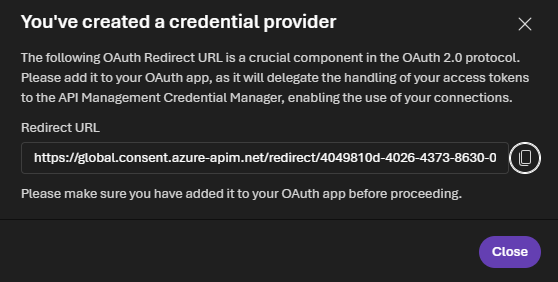

4. Add the consent URL to your Atlassian app's **Callback URLs**:

   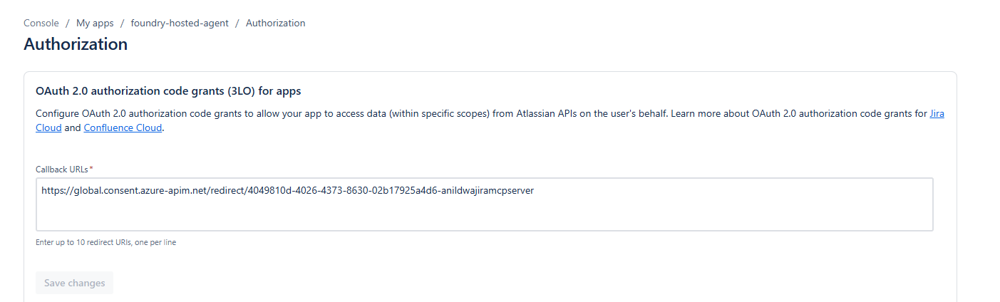

> **Important**: This establishes the two-way trust between Foundry Agent Service and Atlassian Auth. The same approach applies to other third-party services supporting OBO flow.

#### 5.2 Create the Fabric Data Agent MCP Tool

1. In Foundry, navigate to **Build** → **Tools** → **Fabric Data Agent**

2. Enter the Workspace ID and Artifact ID from the published Data Agent

3. Click **Connect** and copy the **Project Connection ID**:

   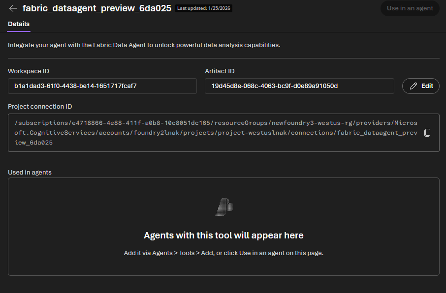

> **Note**: No Microsoft Entra app registration is required for this setup since Fabric Data Agent MCP tool uses the Microsoft Identity platform natively.

---

### 6. Create the Foundry Agent

1. Navigate to the agent scripts directory:
   ```bash
   cd foundry_agents
   ```

2. Configure the environment:
   ```bash
   cp .env.sample .env
   ```

3. Edit `.env` with your values:
   ```env
   foundry_account_name="your_foundry_account_name"
   foundry_project_name="your_foundry_project_name"
   foundry_resource_group="your_foundry_resource_group"
   foundry_subscription_id="your_foundry_subscription_id"
   agent_name="your_agent_name"
   fabrric_data_mcp_tool_name="fabric_data_agent_connection_name"
   mcp_tool_server_name="atlassian_mcp_tool_connection_name"
   mcp_tool_server_url="https://your-mcp-server-url/mcp"
   ```

4. Create and activate a virtual environment:
   ```bash
   python -m venv venv

   # Windows
   venv\Scripts\activate

   # Linux/macOS
   source venv/bin/activate
   ```

5. Install dependencies and create the agent:
   ```bash
   pip install -r requirements.txt
   python create_multitool_prompt_agent.py
   ```

---

### 7. Run the Sample Application

#### 7.1 Start the Backend API

1. Navigate to the backend directory:
   ```bash
   cd foundry_agent_backend_api
   ```

2. Create and configure the environment:
   ```bash
   cp .env.sample .env
   ```

   Edit `.env`:
   ```env
   tenant_id="your_entra_tenant_id"
   foundry_account_name="your_foundry_account_name"
   foundry_project_name="your_foundry_project_name"
   ```

3. Set up the virtual environment:
   ```bash
   python -m venv .venv

   # Windows
   .venv\Scripts\activate

   # Linux/macOS
   source .venv/bin/activate
   ```

4. Install dependencies and start the server:
   ```bash
   pip install -r requirements.txt --pre
   uvicorn foundry_agent_server:app --reload --port 8765
   ```

#### 7.2 Configure and Start the Web App

1. **Create an App Registration** in Microsoft Entra:
   - Application type: Single-page application (SPA)
   - Redirect URI: `http://localhost:3000`
   - API Permissions: Add delegated permission for **Azure Machine Learning Services**

   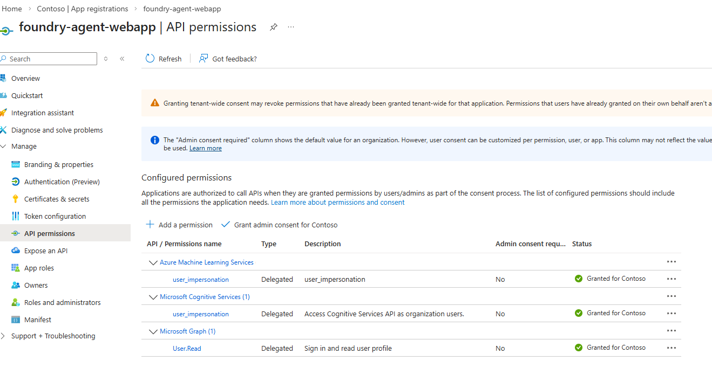

2. Update `spa_foundry_agent_webapp/src/authConfig.js`:
   ```javascript
   export const msalConfig = {
     auth: {
       clientId: "<YOUR_CLIENT_ID>",
       authority: "https://login.microsoftonline.com/<YOUR_TENANT_ID>",
       redirectUri: "http://localhost:3000",
     },
     cache: {
       cacheLocation: "sessionStorage",
       storeAuthStateInCookie: false,
     },
   };

   export const loginRequest = {
     scopes: ["api://<YOUR_CLIENT_ID>/read"],
   };
   ```

3. Start the web application:
   ```bash
   cd spa_foundry_agent_webapp
   npm install
   npm start
   ```

---

## Testing the OBO Flow

### Test Scenario 1: Atlassian Integration

1. Sign in to the web app as **UserA**:

   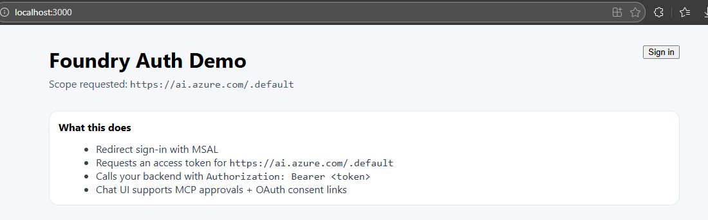

2. Enter your agent name and ask a question about Jira issues:

   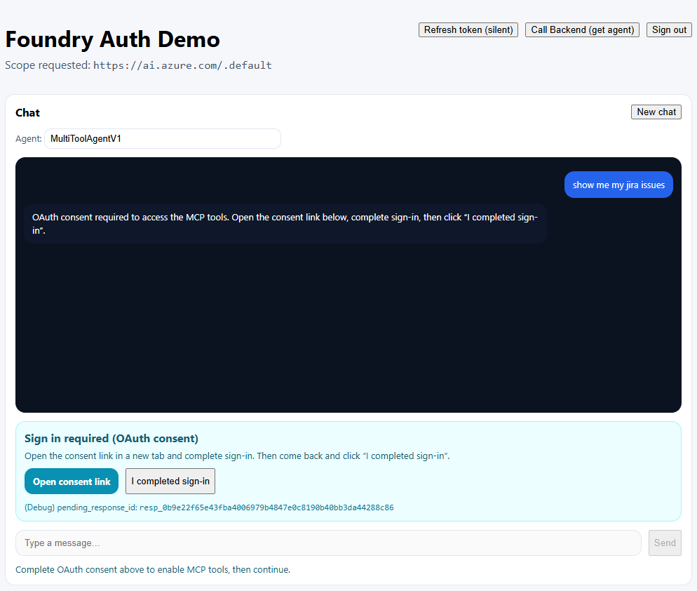

   > **Note**: When a Jira question is asked, the Foundry agent triggers the OAuth flow to get an OBO token for the Atlassian MCP server. The MCP server validates the token and forwards the request to Jira REST API.

3. Complete the Atlassian OAuth consent flow:

   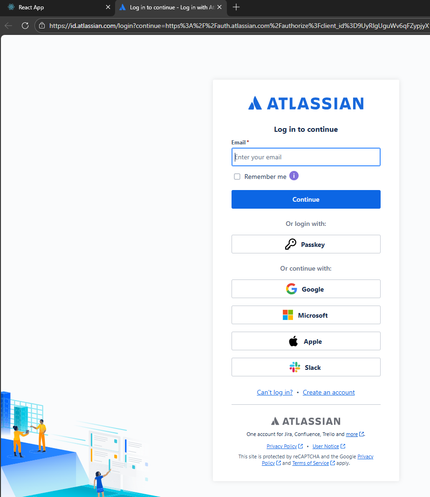

4. Select your Atlassian site and authorize:

   
   
   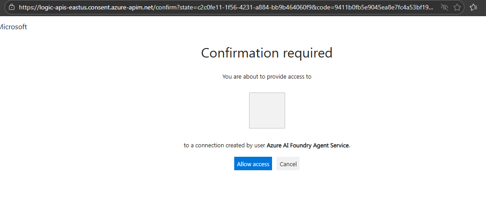

5. Click **"I completed sign-in"** and approve the tool usage:

   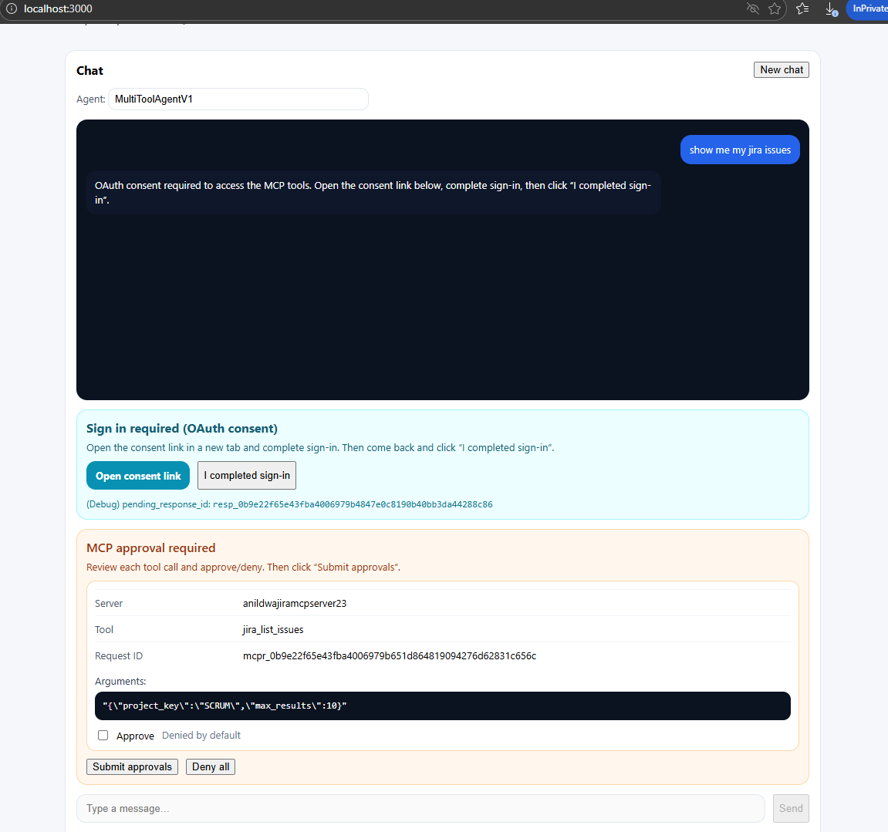

6. View the results based on your Atlassian permissions:

   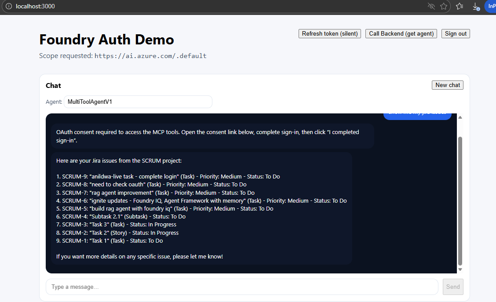

### Test Scenario 2: Fabric Data Agent with RLS

1. Ask about invoice data:
   ```
   Invoice count
   ```

2. **UserA** sees invoices filtered to CustomerID 834 (1,054 records):

   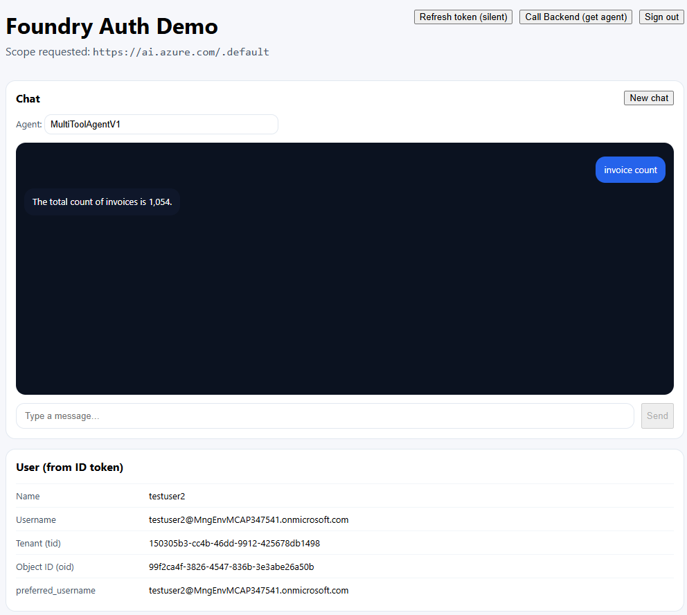

3. **UserB** sees invoices filtered to CustomerID 821 (1,025 records):

   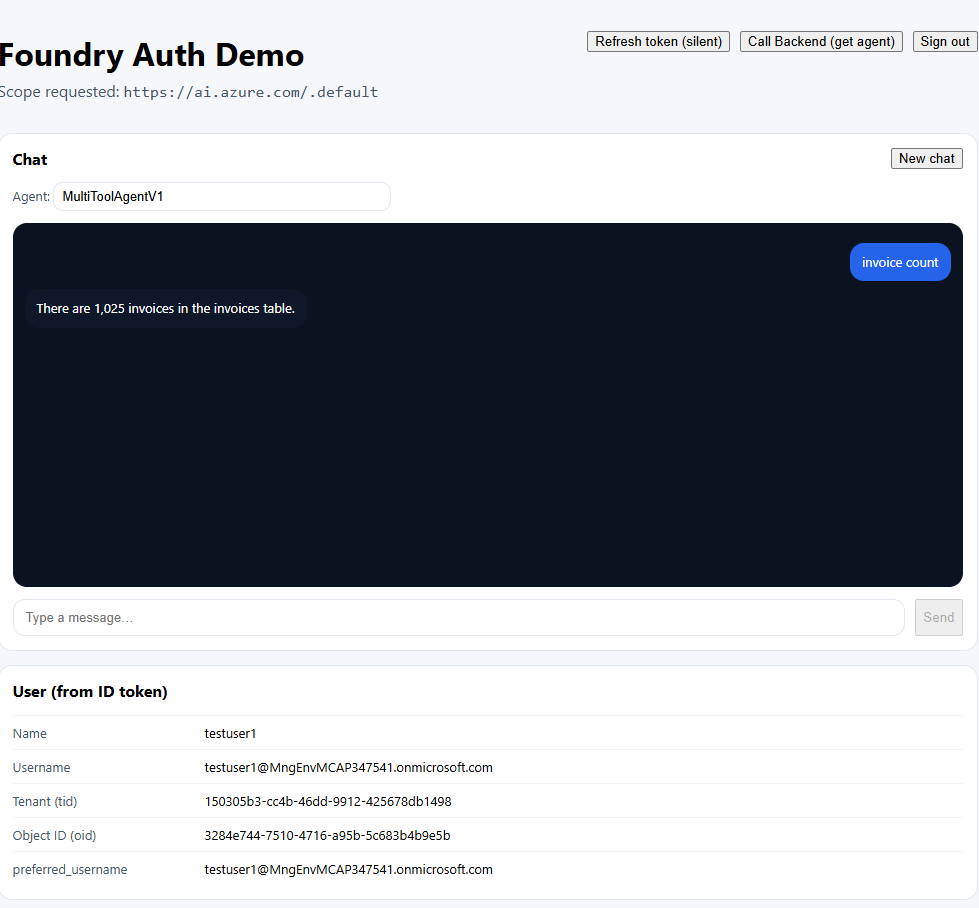

This demonstrates that row-level security is enforced based on the authenticated user's identity through the OBO flow.

---

## Troubleshooting

| Issue | Possible Cause | Solution |
|-------|----------------|----------|
| 401 Unauthorized from MCP Server | Invalid or missing OBO token | Verify Atlassian app configuration and token scopes |
| Consent URL not working | Callback URL mismatch | Ensure the Foundry consent URL is added to Atlassian app callbacks |
| Fabric Data Agent returns no data | RLS misconfiguration | Verify OneLake Security roles are correctly assigned to users |
| Token validation failed | Issuer mismatch | Check that tenant ID is correct in backend `.env` |
| Agent not found | Agent not published | Ensure the agent was created and published in Foundry |
| CORS errors in browser | Backend not configured | Verify CORS origins in `foundry_agent_server.py` include `http://localhost:3000` |

---

## Additional Resources

- [Azure AI Foundry Documentation](https://learn.microsoft.com/en-us/azure/ai-services/agents/)
- [Microsoft Fabric Data Agent](https://learn.microsoft.com/en-us/fabric/data-engineering/)
- [Atlassian OAuth 2.0 (3LO)](https://developer.atlassian.com/cloud/confluence/oauth-2-3lo-apps/)
- [MSAL.js for React](https://github.com/AzureAD/microsoft-authentication-library-for-js)
- [FastMCP Documentation](https://github.com/jlowin/fastmcp)

---

## License

This project is provided as sample code for demonstration purposes. Please refer to your organization's licensing requirements for production use.


